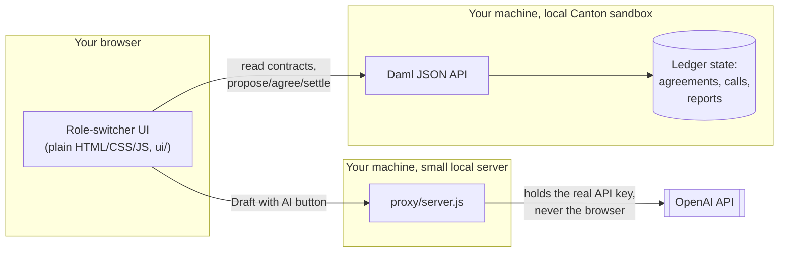
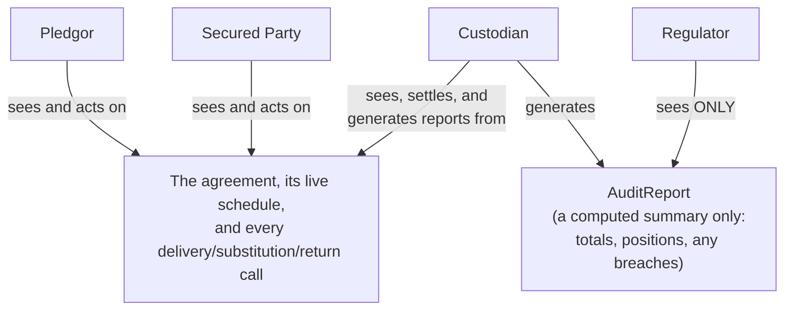

# Mobilis

An atomic, privacy-preserving collateral mobility engine for Canton.

Built for HackCanton Season 3, RWA & Business Workflows track.

Repo: [github.com/angelraph/mobilis](https://github.com/angelraph/mobilis)
Demo video (3.5 min, narrated, recorded from a live Canton ledger): [mobilis-demo.mp4](https://mobilis-angelraphs-projects.vercel.app/media/mobilis-demo.mp4)
Roadmap: [docs/ROADMAP.md](docs/ROADMAP.md) · FAQ: [docs/FAQ.md](docs/FAQ.md)

## Quick start: run it on a real Canton ledger

Needs Git, Java 17 and the Daml SDK 2.10.6 (on Windows, use Git Bash).
Full step-by-step guide: [docs/RUN-LOCALLY.md](docs/RUN-LOCALLY.md), also at
[mobilis-angelraphs-projects.vercel.app/run-locally.html](https://mobilis-angelraphs-projects.vercel.app/run-locally.html).

```bash
git clone https://github.com/angelraph/mobilis.git
cd mobilis
sh scripts/demo-ledger.sh
```

Then open http://localhost:7575/ui/demo-wall.html to see all four roles on
one screen.
Static UI preview (sample data, no live ledger; see below): [mobilis-angelraphs-projects.vercel.app](https://mobilis-angelraphs-projects.vercel.app)

## The one-line pitch

Mobilis lets a pledgor, a secured party, and a custodian move, substitute,
and recall eligible collateral against a live margin obligation. Each party
sees only their slice of the truth. A regulator gets an automated exposure
and compliance report without ever seeing anyone's full book.

## Pre-existing work vs. work done during the hackathon

HackCanton's rules allow building on existing code as long as it is
disclosed and the new work can be told apart. So, plainly:

- **Before the delivery phase (Sep 13, 2026):** everything up to and
  including commit `5f69c00`, tagged `pre-hackathon-baseline`. That was the
  first version of the Daml model (agreement, calls, eligibility check by
  asset type, audit report), the role-switcher UI, the AI narrative proxy,
  and the docs.
- **During the delivery phase (Sep 18 to Oct 9, 2026):** every commit after
  that tag. Compare with
  `git diff pre-hackathon-baseline..HEAD`, or see the list in
  [Built during HackCanton](#built-during-hackcanton) below.

## Built during HackCanton

The baseline checked one thing: whether an asset type was eligible. It
trusted the caller for what an asset was worth, and a substitution never
checked value, so a $10M bond could be swapped for $1 of an eligible asset.
The delivery-phase work turns Mobilis into a collateral engine that
enforces the whole rulebook on the ledger:

| Problem a collateral desk has | What the ledger now does | Where |
|---|---|---|
| Is this asset eligible? | Rejects ineligible assets at Agree (baseline) | `Valuation.checkMove` |
| What is it actually worth? | Computes posted value from the agreed haircut and ignores what the caller sends | `Valuation.valueAsset`, `CollateralAgreement_ProposeCall` |
| Is the exposure still covered? | Tracks required collateral from margin calls, and refuses any return or substitution that would leave the book short | `State_ApplyMarginCall`, `Valuation.checkMove` |
| Is the book too concentrated? | Enforces per-asset-type concentration limits | `Valuation.concentrationBreaches` |
| Is a margin call really met? | Marks a margin call fulfilled only when posted value covers what's required | `MarginCall_MarkFulfilled` |
| Did the position move after the deal was agreed? | Settlement re-runs the rulebook against the book as it stands at settlement | `State_ApplyCall` |
| Which asset should I post? | A collateral optimiser finds the cheapest swap the rules allow. The AI picks among rule-checked moves only, and the ledger checks the pick again | `ui/rules.js`, `proxy/server.js` `/suggest-substitution` |
| What if prices move? | The custodian marks prices to market (`State_MarkPrices`) and the whole book re-values in the same transaction; a drop that leaves it short blocks every release until a top-up | `State_MarkPrices`, `Valuation.valueAssetAt` |
| I'm short, or over-covered: what now? | Proposes the cheapest top-up that restores coverage, or the lots that can go back without leaving the book short, one click each | `ui/rules.js` `suggestTopUps`, `suggestReturns` |
| What does the regulator see? | Coverage ratio, required collateral, share of book per asset type, eligibility and concentration breaches, and which price marks the figures use, still as a summary only | `AuditReport` |
| Can the browser's preview be trusted? | 16 shared rulebook cases are run against both the ledger's Daml rulebook and the browser's JavaScript copy; both must agree | `ui/parity-cases.json`, `ParityCases.daml`, `ui/rules.test.js` |

`daml test` runs 20 Daml Script tests (`daml/daml/Tests.daml`), most of
them negative paths: an ineligible asset, an undercollateralising
substitution or return, a concentration breach, releasing an asset that
isn't posted, a margin call applied twice or marked fulfilled while short,
wrong controllers, settlement after the book moved, a price drop blocking
releases until a top-up, and the regulator seeing nothing but its report.
It also runs `ParityCases.daml`, generated from `ui/parity-cases.json` by
`scripts/gen-parity.py`; `node --test ui/rules.test.js` runs the same cases
against the browser's copy of the rules.

## Why this, why now

Canton's own ecosystem is currently focused on exactly this problem, not
generic asset issuance. Canton Network's Industry Working Group is actively
advancing cross-border collateral mobility in 2026. Broadridge's
Distributed Ledger Repo platform already runs $8T+/month in repo volume on
Canton infrastructure. DTCC is moving tokenized Treasuries toward
production this year. HQLAx, a collateral-mobility specialist, just took
strategic investment from Broadridge and Digital Asset.

The pain is quantified and large: an estimated €1.6 to 8B a year
industry-wide in manual corporate-action and collateral processing cost,
$4.7B a year in operational risk for custodians, and 46% of corporate-action
data still handled manually (SIX).

See [docs/business-brief.md](docs/business-brief.md) for the full ICP,
who-pays, and pilot-plan writeup, and
[docs/pitch-outline.md](docs/pitch-outline.md) for the live-pitch structure.

New here and want the system explained from scratch, diagrams included,
before diving into code? Start with
[docs/architecture.md](docs/architecture.md).

## The workflow

```
 Issuance             State change        Transfer / fulfillment      Audit

 CollateralAgreement  MarginCall     CollateralCall (Delivery,      AuditReport
 (terms and           (a demand      Substitution, or Return)      (custodian-
 eligibility)         for more or    Outstanding to Agreed or      computed
                       less           Disputed to Settled           summary; the
                       collateral)                                  only contract
                                                                     type the
                                                                     regulator
                                                                     ever sees)
```

Four roles, four different views of the same ledger:

| Role | Sees | Never sees |
|---|---|---|
| Pledgor | The agreement, the live schedule, every call it's party to | The regulator's report |
| Secured Party | Same as pledgor (it's the counterparty) | The regulator's report |
| Custodian | Everything operational: agreement, schedule, calls, because it settles them | Nothing hidden from it; it's the settlement agent |
| Regulator | Only `AuditReport`: a computed summary of totals, positions by asset type, eligibility breaches, and a plain-English narrative | The raw schedule, the raw calls, any party's full book |

That last row is the whole thesis and the live-demo moment: refresh four
screens off one atomic transaction and watch the regulator's screen show
less, correctly, by construction. Not because a UI hid a column, but because
that participant's ledger literally holds no other contract type for this
agreement.

## Architecture





Full write-up of how this works, including the call-lifecycle state
diagram and a step-by-step testing guide, is in
[docs/architecture.md](docs/architecture.md). Written for a first-time
reader, no Daml or blockchain background assumed.

## Repo layout

```
daml/               the Daml model
  daml/
    Types.daml                shared data types
    Valuation.daml            the rulebook: haircuts, coverage, concentration,
                               and checkMove, the one check every movement passes
    CollateralAgreement.daml  CollateralAgreement, CollateralAgreementState, MarginCall, CollateralCall
    AuditReport.daml          the regulator-facing summary contract
    Setup.daml                a Daml Script that runs one full margin cycle and
                               proves the privacy model by querying the ledger
                               as each party
    Tests.daml                20 Daml Script tests, mostly negative paths
    ParityCases.daml          generated: the shared rulebook cases, run on the ledger
  daml.yaml
ui/                  the app, the four-view wall, and the marketing pages (Vercel root)
  index.html, app.js the role-switcher app
  demo-wall.html     all four roles on one screen
  home.html ...      marketing pages, generated by scripts/build-site.py
  rules.js           JavaScript mirror of Valuation.daml, for previews and suggestions
  rules.test.js      runs the shared parity cases against rules.js (node --test)
  parity-cases.json  the shared rulebook cases
  sample-data.js     static preview data for deployments with no ledger
  config.js          generated; see scripts/generate-config.sh
scripts/
  demo-ledger.sh       fresh local ledger + interface (see docs/RUN-LOCALLY.md)
  hosted-ledger.sh     the public demo ledger's runner (Dockerfile), resets on a schedule
  generate-config.sh   regenerates ui/config.js after every 'daml build'
  gen-parity.py        turns ui/parity-cases.json into ParityCases.daml
  build-site.py        builds the marketing pages
  record-demo.js       records the demo video; time-cycle.js times a full cycle
Dockerfile           the public demo ledger (see docs/HOSTING.md)
docs/
  RUN-LOCALLY.md          step-by-step: run it on a real ledger
  HOSTING.md              host the public demo ledger
  ROADMAP.md, FAQ.md      where it goes next, and plain answers
  architecture.md         how the system works and how to test it, for a first-time reader
  business-brief.md       the track's required 1-page business brief
  pitch-outline.md        the live-final pitch cue-card (beats and timing)
  pitch-script.md         the full word-for-word script behind it
  setup-guide.md          how the Daml SDK is set up and how to run this project
  devnet-deployment.md    checklist for when real DevNet access lands
```

## The role-switcher UI

A plain HTML, CSS, and JavaScript page, no build step and no framework,
served same-origin by Daml's JSON API so there's no separate dev server or
CORS to fight. Open it once per role in separate tabs to run the live
four-screen demo:

```
http://localhost:7575/ui/index.html?role=Pledgor
http://localhost:7575/ui/index.html?role=SecuredParty
http://localhost:7575/ui/index.html?role=Custodian
http://localhost:7575/ui/index.html?role=Regulator
```

Each tab shows only what that party can see, polls for updates, and can
drive the full lifecycle (propose delivery or substitution, agree or
dispute, settle, generate the report) with real buttons hitting real Daml
choices. Party IDs and the current package ID are discovered at runtime,
not hardcoded, so it survives sandbox restarts; see
[docs/setup-guide.md](docs/setup-guide.md) for exactly how to run it and
the one thing to regenerate after a Daml rebuild.

It's responsive down to a phone-width screen: the data tables collapse
into stacked label/value cards below 640px instead of overflowing.

The same static files are also deployed to Vercel at
[mobilis-angelraphs-projects.vercel.app](https://mobilis-angelraphs-projects.vercel.app)
for a quick look without installing anything. There's no Daml ledger
behind that deployment (Vercel hosts static sites, not a JVM sandbox), so
it automatically falls back to a bundled sample dataset (the demo
scenario's book just before its substitution, so the optimiser has a move
to suggest), clearly labeled as a static preview. Actions
show an honest message instead of failing. Run it locally per the setup
guide for the real, live, interactive version.

One thing worth knowing before showing this to anyone outside a local
sandbox: the UI authenticates by minting its own tokens in the browser
with a fixed, public string, because the local sandbox doesn't verify
token signatures at all. That's normal and fine for a single-user local
demo. It is not access control, and `ui/app.js` says so at the top in
plain terms. Before this ever points at a shared environment or DevNet,
that needs replacing with a real per-user login.

## Status

The Daml model layer is built, running, and verified. It was ported into
current Daml syntax from the domain concepts in Digital Asset's official
`ex-collateral` reference; that repo is archived and written in 2020-era
syntax, so it was used as a conceptual reference (eligibility and haircuts,
the Delivery/Substitution/Return call lifecycle, Outstanding to
Agreed/Disputed to Settled), not literal starter code.

`daml build` compiles clean with zero warnings, and the full lifecycle
script (`daml/daml/Setup.daml`) has been run end to end against a live
sandbox. The privacy check, the entire thesis of this product, passed
exactly as designed:

```
Regulator sees 1 audit report(s), expect 1
Regulator sees 0 raw collateral call(s), expect 0
Regulator sees 0 raw schedule state(s), expect 0
```

After the delivery-phase work, `daml test` passes all 20 tests, the
parity cases and the Setup scenario. A second live run covered the price
feed: a mark to 80 left the book 40,000 short, a return was refused, the
suggested top-up restored coverage, an excess appeared after the exposure
fell, and a suggested return settled. The UI was also driven against a live sandbox
through its own action functions: a margin call applied, "Mark fulfilled"
refused by the ledger while the book was short, a top-up delivered, an
undercollateralising return refused at Agree, an optimiser-suggested
substitution proposed, agreed and settled, and the regulator's report
showing coverage and concentration with zero raw calls or state visible.

See [docs/setup-guide.md](docs/setup-guide.md) for the exact commands (a
Daml SDK and JDK are installed on this machine) and what's next.

## Not yet built

DevNet deployment. It's gated behind the hackathon's own onboarding
(opens with the Delivery phase, not self-serviceable today) rather than
something to build ahead of time; see
[docs/devnet-deployment.md](docs/devnet-deployment.md) for the checklist
to run through the moment access lands, including the one thing in this
repo that is explicitly not ready for a real network (the local-dev auth
in `ui/app.js`).

See the plan file this was scaffolded from for the week-by-week build order.
