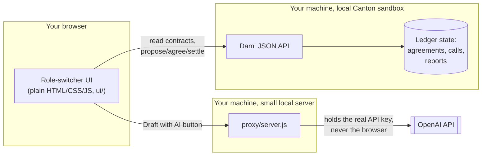
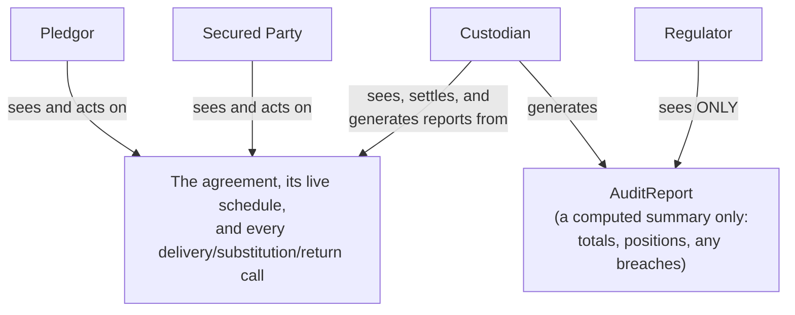
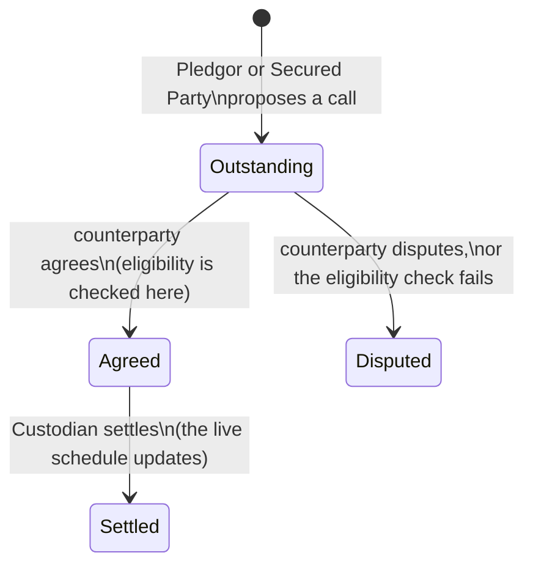
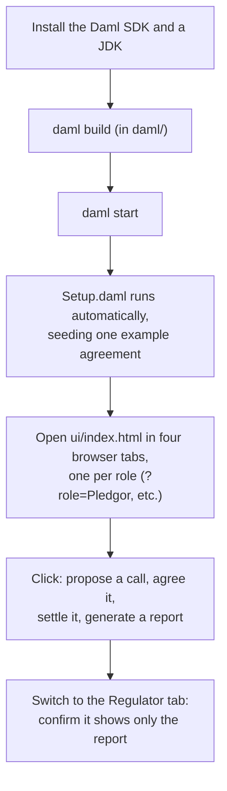

# How Mobilis Works

This explains the system for anyone, including someone who has never
touched Daml, Canton, or blockchain before. If you already know Daml,
skim the diagrams and skip to [Testing it yourself](#testing-it-yourself).

## The short version

Mobilis has three moving pieces on your own machine, nothing hosted, no
account needed:

1. A small local ledger (called a "sandbox") that runs the actual rules
   of the collateral workflow.
2. A web page you open in your browser, one copy per party, so you can
   see how the same event looks different depending on who you are.
3. A tiny local server that talks to an AI model, only used for one
   optional button.

Nothing here talks to the real Canton Network. It's a self-contained
sandbox for building and demonstrating the idea before it ever touches a
shared, real network.

## Two ideas you need before anything else makes sense

**A "party"** is just a participant with a name, like Pledgor or
Custodian. In this project there are four: the party posting collateral
(Pledgor), the party receiving it (Secured Party), the party that settles
movements (Custodian), and the party auditing the relationship
(Regulator).

**A "contract"** is a record on the ledger, like a row in a database, but
with a rule attached to it about exactly who is allowed to see it and who
is allowed to change it. That second part, the visibility rule, is the
entire point of this project. A normal database shows a row to anyone
with a login. A Daml contract shows itself only to the specific parties
named on it, and to nobody else, enforced by the ledger itself rather
than by an application choosing to hide a column.

## System architecture

Everything in the two left boxes runs on your own computer when you
follow the steps below. The only thing that leaves your machine at all is
the one AI-drafting request, sent by the proxy, never by the browser
directly, so the API key is never exposed to anyone looking at the page.

## Who can see what

This is the part worth actually understanding, because it's the whole
product idea, not an implementation detail.

Pledgor, Secured Party, and Custodian all see the full operational
picture, because they're the ones actually moving collateral. The
Regulator sees exactly one thing: a computed report the Custodian
generates. Not a limited view of the agreement. Not a redacted copy.
Nothing else at all. If you log in as the Regulator in the UI, the
agreement and every call are simply absent, the same way a document
you were never given access to doesn't show up in your inbox.

## The lifecycle of one collateral movement

Every delivery, substitution, or return goes through the same states,
whether it succeeds or gets rejected:

The eligibility check at the "Agreed" step is not a UI convenience. It's
enforced inside the Daml choice itself: if someone tries to agree to
moving in an asset that was never on the agreed schedule, the ledger
rejects the transaction outright, before it can ever reach "Settled."
That's been tested directly: see
[setup-guide.md](setup-guide.md#3-run-it) for the actual rejected-transaction
output from a real run.

## Where the AI fits in

Only one thing in this whole system is AI-assisted: the plain-English
sentence at the bottom of an audit report. The Custodian can click
"Draft with AI," which sends the already-computed numbers (never the
other way around) to an LLM and gets back a sentence to review and edit.
Every number in the report, the total, the positions, whether anything
breaches eligibility, is computed by the Daml ledger regardless of
whether that button is ever clicked. The AI never invents a figure; it
only describes ones that already exist.

## Testing it yourself

In plain steps:

1. **Install the Daml SDK and a JDK.** The SDK compiles and runs the
   Daml code; the JDK is needed because the local ledger and its API run
   on the JVM. Exact commands and versions used are in
   [setup-guide.md](setup-guide.md#1-whats-installed).
2. **Build the model.** From the `daml/` folder, run `daml build`. This
   turns the `.daml` source files into a single package (a `.dar` file)
   the ledger can run.
3. **Start everything.** `daml start` builds if needed, starts the local
   ledger, runs a script that creates one example agreement and a few
   calls automatically, and serves the UI. Full command in
   [setup-guide.md](setup-guide.md#3-run-it).
4. **Open the UI four times**, once per role, using a URL like
   `http://localhost:7575/ui/index.html?role=Pledgor` and swapping the
   role for `SecuredParty`, `Custodian`, and `Regulator`. Four browser
   tabs side by side is the intended way to see this, since the whole
   point is that the same event looks different from each one.
5. **Do something and watch it appear elsewhere.** Propose a
   substitution as Pledgor, then check the Custodian tab a few seconds
   later without refreshing. It'll be there. Agree it as Secured Party,
   settle it as Custodian, generate a report, then check the Regulator
   tab. It'll show the new report and, still, nothing else.
6. **Try to break it.** Propose a substitution into an asset that was
   never listed as eligible, and try to agree it. It gets rejected by the
   ledger, not by the UI politely refusing to let you click a button.
   That rejection is the actual proof this isn't just decoration.

If something doesn't compile or a step behaves differently than
described, [setup-guide.md](setup-guide.md) also documents the exact
issues hit while building this and how they were fixed, which covers
most of what a first-time Daml user is likely to run into.

## Common questions

**Is this connected to the real Canton Network?** No. Everything above
runs on a local sandbox on your own machine. See
[devnet-deployment.md](devnet-deployment.md) for what connecting to the
real network would actually require.

**Do I need to know Daml to try this?** No, to click through the UI. Yes,
eventually, to read or change the `.daml` files, though
[CollateralAgreement.daml](../daml/daml/CollateralAgreement.daml) is
commented throughout with what each piece is for.

**Is my OpenAI key safe if I clone this repo?** Yes, as long as you never
commit `proxy/.env`. It's gitignored already. The key lives only in that
one local file and is never sent to the browser.

**Why isn't the Regulator just given a filtered view in the UI?** Because
that would be a much weaker claim. A UI can always be bypassed by calling
the API directly. Here, calling the API directly as the Regulator gets
you the same nothing, because the ledger itself never gave that party's
node the data in the first place.
